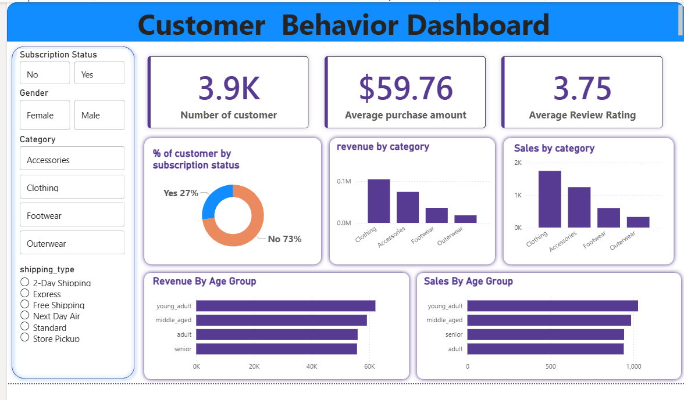

# Customer-Behavior-Data-Analysis-Python-Sql-Powerbi
This is an end to end data analysis project showcasing customer behavior analysis using python, sql and power bi.
# 📊 End-to-End Data Analysis Project

## 🚀 Project Overview

This project demonstrates a complete Data Analytics workflow, starting from raw data and ending with an interactive Power BI dashboard.

The objective of this project is to transform raw data into meaningful business insights by performing:

* Data Loading & Exploration using Python
* Exploratory Data Analysis (EDA)
* Data Cleaning & Preprocessing
* SQL Analysis using MySQL Workbench
* Interactive Dashboard Creation in Power BI

This project showcases the practical skills required for a Data Analyst role and follows an industry-standard analytics pipeline.

---

## 🛠️ Tech Stack

### Programming & Analysis

* Python
* Pandas
* NumPy
* Matplotlib
* Seaborn

### Database

* MySQL
* MySQL Workbench

### Visualization

* Power BI

### Development Environment

* Jupyter Notebook

---

## 📂 Project Workflow

### 1️⃣ Data Collection

* Imported the dataset into Jupyter Notebook.
* Examined dataset structure and data types.
* Performed initial exploration to understand the data.

### 2️⃣ Exploratory Data Analysis (EDA)

Performed detailed analysis to uncover patterns and trends:

* Dataset overview
* Statistical summary
* Missing value analysis
* Duplicate record detection
* Correlation analysis
* Distribution analysis
* Outlier detection
* Feature relationship analysis

### 3️⃣ Data Cleaning

Data preprocessing steps included:

* Handling missing values
* Removing duplicate records
* Correcting inconsistent entries
* Converting data types
* Formatting date columns
* Creating derived features
* Preparing clean data for SQL analysis

### 4️⃣ SQL Analysis

After cleaning the dataset, the data was loaded into MySQL.

Business questions were answered using SQL queries such as:

* Top-performing categories
* Revenue analysis
* Customer behavior analysis
* Trend analysis
* KPI calculations
* Ranking and aggregation queries

SQL concepts used:

* SELECT Statements
* WHERE Clause
* GROUP BY
* ORDER BY
* Aggregate Functions
* CASE Statements
* Joins
* Subqueries
* Window Functions

### 5️⃣ Power BI Dashboard

Created an interactive dashboard to visualize key insights.

Dashboard Features:

* KPI Cards
* Trend Analysis
* Category Performance
* Interactive Filters
* Slicers
* Charts & Visualizations
* Business Insights Summary

---

## 📈 Key Insights

Some important insights generated from the analysis include:

* Identified top-performing categories/products.
* Discovered customer purchasing trends.
* Analyzed revenue and profit patterns.
* Found seasonal and monthly trends.
* Highlighted business opportunities through data-driven insights.

## 📁 Project Structure

Data-Analysis-Project/
│
├── Dataset/
│   └── customer_shopping_behavior.csv
│
├── Python/
│   └── Data_Analysis.ipynb
│
├── SQL/
│   └── customer_shopping_workbench.sql
│
├── PowerBI/
│   └── customer_shopping.pbix
│
├── Images/
│   ├── customer_shopping.png
│  
│
└── README.md

---

## 📸 Dashboard Preview

### Power BI Dashboard

---

## 🎯 Project Objectives

* Practice real-world data analytics workflow.
* Improve Python data analysis skills.
* Strengthen SQL querying abilities.
* Build interactive Power BI dashboards.
* Generate actionable business insights.

---

## 🔮 Future Improvements

* Automate ETL process.
* Deploy dashboard online.
* Integrate larger datasets.
* Add predictive analytics using Machine Learning.
* Create automated reporting workflows.

---

## 👨‍💻 Author

**Sumit Girase**

Electronics & Telecommunication Engineering Student

Skills:

* Python
* SQL
* Power BI
* Data Analytics
* Data Visualization

### Connect With Me

* LinkedIn: https://www.linkedin.com/in/sumit-girase-5672352b0
* GitHub: https://github.com/sumitgirase

---

⭐ If you found this project useful, consider giving it a star!

